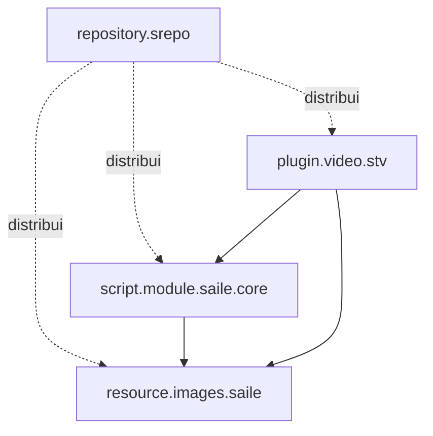

# Blueprint do repositório

```text
s_kodi_addon/
├── .agents/                             # instruções e base corporativa
├── .github/workflows/
├── addons/
│   ├── repository.srepo/
│   ├── resource.images.saile/
│   │   └── resources/media/
│   │       ├── common/
│   │       └── stv/
│   ├── script.module.saile.core/
│   │   └── lib/saile_core/
│   └── plugin.video.stv/
│       └── resources/lib/stv/
├── artwork/                             # fontes e assets visuais canônicos
├── tests/                               # suíte de testes unitários
├── tools/                               # automação, build e validação
├── docs/                                # repositório estático publicado no GitHub Pages
├── .env.example
├── .gitignore
├── AGENTS.md
└── README.md
```

## Grafo de dependências



## Conteúdo permitido no core (`script.module.saile.core`)

- caminhos portáveis Kodi (`special://`);
- artwork compartilhado (`resource.images.saile`);
- notificações nativas do Kodi;
- erros padronizados (`SaileError`);
- logging sanitizado;
- detecção de capacidades do dispositivo e SQLite.

## Conteúdo proibido no core

- endpoints Xtream;
- matching TMDB;
- categorias e persistência de TV, filmes ou séries;
- rotas específicas do plugin de vídeo.

## Add-ons futuros condicionais

```text
service.saile.monitor       após necessidade funcional comprovada
repository.srepo.beta       após existir processo de release estável
```
