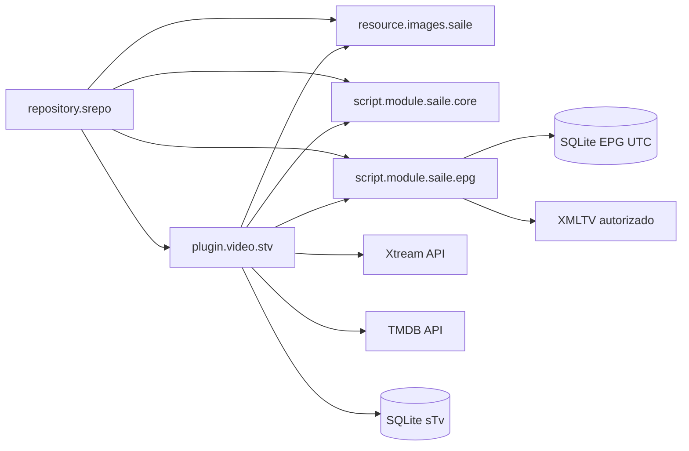

# Arquitetura derivada do roadmap

## Visão



## Navegação sTv

```text
sTv
├── TV ao Vivo
│   ├── Buscar
│   ├── Favoritos
│   └── categorias/canais dinâmicos
├── VOD
│   ├── Buscar
│   ├── Favoritos
│   └── categorias/filmes dinâmicos
├── Séries
│   ├── Buscar
│   ├── Favoritos
│   └── categorias/séries dinâmicas
└── Sincronizar Dados
```

## Fluxo do sTv (IPTV)

1. Usuário configura host, usuário e senha Xtream nas configurações do Kodi.
2. Cliente valida autenticação e normaliza payloads.
3. Sincronização do catálogo executa UPSERT em SQLite local (`stv.db`).
4. Home e categorias navegam prioritariamente pelo cache local com suporte a TTL.
5. `Buscar` e `Favoritos` aparecem sempre antes do conteúdo de cada seção.
6. URL de reprodução direta é construída no último momento pelo player.
7. TMDB enriquece metadados (plot, pôster e fanart HD) sob demanda.
8. O módulo EPG sincroniza XMLTV somente por ação manual e o sTv consulta Agora/Próximo localmente.

## Artwork

`resource.images.saile` contém exatamente nove artes fixas de menu/pop-up/fallback (5 comuns + 4 sTv). Cada add-on mantém sua identidade (`icon.png` e `fanart.jpg`). Capas e fanarts de conteúdo são dinâmicas, fornecidas por Xtream ou TMDB e cacheadas pelo Kodi.

## Sincronização LAN

O item `Sincronizar Dados` na home é sempre explícito e sob demanda do usuário. A implementação troca registros versionados e sanitizados entre dispositivos na mesma rede; não compartilha `.db` e não sincroniza catálogo, cache ou segredos.

## Fases do Projeto

1. Módulos compartilhados, contratos de navegação e build.
2. MVP sTv: autenticação, catálogo e reprodução.
3. Favoritos, busca local, TMDB e persistência do sTv.
4. EPG modular com XMLTV, UTC e cache independente.
5. Sincronização LAN manual.
6. Recursos futuros: serviço contínuo, canal beta e PVR avançado.
